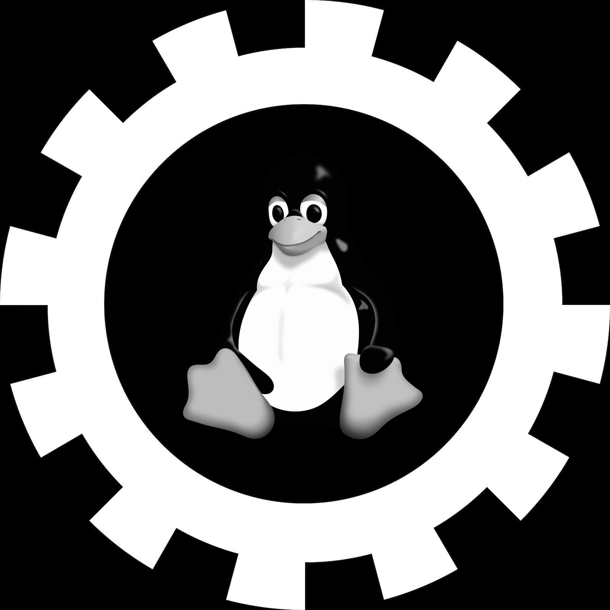

# unix • [](https://github.com/abigger87/unix/actions/workflows/ci.yaml) [](https://opensource.org/licenses/Apache-2.0) [](https://img.shields.io/github/languages/code-size/abigger87/unix?label=size)

A **lightweight**, **extensible** [foundry](https://github.com/foundry-rs/foundry) library for shell scripting.


## What?

**unix** is an extensible wrapper for common unix shell commands. It provides a minimal api for interacting with shell commands from inside Solidity using [foundry](https://github.com/foundry-rs/foundry)'s [fii](https://book.getfoundry.sh/cheatcodes/ffi.html).


## Installation

```
forge install abigger87/unix
```

## Usage

_NOTE: You must enable [ffi](https://book.getfoundry.sh/cheatcodes/ffi.html) in order to use this library. You can either pass the `--ffi` flag to any forge commands you run (e.g. `forge script Script --ffi`), or you can add `ffi = true` to your `foundry.toml` file._

_NOTE: **unix** assumes you are running on a UNIX based machine with `bash`, `tail`, `sed`, `tr`, `curl` and `cast` installed._


1. Add this import to your script or test:
```solidity
import {Unix} from "unix/Unix.sol";
```

2. Add this directive inside of your Contract:
```solidity
using Unix for *;
```

3. Run your shell commands:
```solidity
// Cat a file
(uint256 status, bytes memory data) = "cat \"README.md\"".run();

// Echo a string
(uint256 status, bytes memory data) = "echo \"Hello World\"".run();
```

We have provided extensive examples in [scripts](./script/) and further completeness is demonstrated in [tests](./test/Unix.t.sol).

To run scripts, simply prefix the script name with `forge s` like so: `forge s <script_name>`. For example, to run the [echo](./script/echo.s.sol) script, run: `forge s echo`.


## Contributing

_NOTE: This library is built using [Foundry](https://getfoundry.sh). To learn more about foundry and its usage, please refer to [foundry book](https://book.getfoundry.sh/getting-started/installation.html)._

All contributions are welcome! We want to make contributing to this project as easy and transparent as possible, whether it's:
  - Reporting a bug
  - Discussing the current state of the code
  - Submitting a fix
  - Proposing new features
  - Becoming a maintainer

We use GitHub issues to track public bugs. Report a bug by [opening a new issue](https://github.com/abigger87/unix/issues/new); it's that easy!

To run tests, install and update modules with `forge update` and run `forge test` to run all tests!


## Safety

This is **experimental software** and is provided on an "as is" and "as available" basis.

We **do not give any warranties** and **will not be liable for any loss** incurred through any use of this codebase.


## Acknowledgements

- [Surl](https://github.com/memester-xyz/surl)
- [Solenv](https://github.com/memester-xyz/solenv)
